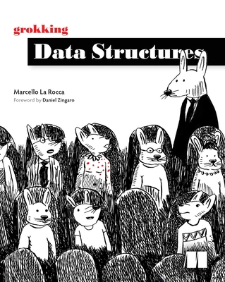

# 資料結構與演算法
- 講師：林志偉
- 教材：https://github.com/mingfujacky/Lecture-Data-Structure.git

# Textbook

- Grokking Data Structures
- La Rocca, Marcello
- Manning, 2024

# 課程講師 - 林志偉 (Jacky Lin)

- #### 現職: 陽明交通大學 / 學士後電子與光子學士學位學程 助理教授
- #### 學歷: 交大資訊管理博士
- #### 經歷: 台積電資訊科技(IT)
- #### 專長: 資料工程、程式設計、巨量資料分析
- #### Email: jacky.jw.lin@nycu.edu.tw

# 課程助教
謝勵維 hsiehliwe.sc12@nycu.edu.tw

# 課程規劃
- #### 課程目標
  *-* Introduce basic data structures that every programmer needs to know.
  *-* Use Python to implement basic algorithms to sharpen coding skill.

- #### 授課方式
  *-* 教材講解
  *-* 課堂 Lab 實作 (上課請攜帶電腦)

# 評分方式
- Attendance(10%): roll call and QA
- Homework (40%): 8 times
- Mid-term exam (25%): closed-book exam
- Final-term exam (25%): closed-book exam

# 授課大綱
[113下學期](https://timetable.nycu.edu.tw/?r=main/crsoutline&Acy=113&Sem=2&CrsNo=520018&lang=)

# 時時實際操作
 
>我鼓勵你使用鍵盤手動複製這些程式，而不是直接將其原始程式碼複製貼上到新檔案中；這有助於你對程式產生「肌肉記憶」，並迫使你在鍵入時考慮每一行。

# [AI正在創造新一代文盲工程師？](https://buzzorange.com/techorange/2025/02/19/ai-and-learning/)
- 一位擁有12年coding經驗的資深工程師 Namanyay，揭露自己用 AI 寫程式後，開始停止閱讀文件、除錯能力退步，後來也不再閱讀錯誤訊息，只是進行複製貼上。驚覺 coding 技術變差的他開始「復健計畫」，規定自己每週一天不用 AI 寫程式。
- AI使得過去解決問題的 Coding 基礎知識消失了
- 如何在使用 AI 的同時保持思考？
  - 以學習心態使用 AI。當獲得解答時，深入詢問原因，理解背後的邏輯。
  - 與其他工程師交流討論
  - 在進行程式碼檢查時，要用不同角度來檢視
  - 偶爾嘗試從零開始編寫程式