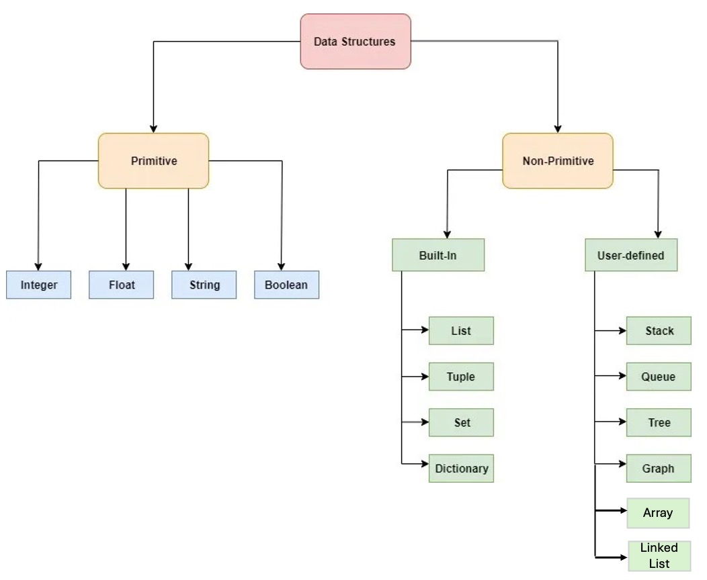

# Integrated Development Environment (IDE)

[An IDE running environment](https://github.com/mingfujacky/Lecture-Python/blob/main/1_python_basic/C_thonny_introduction.md#一個可以執行-python-程式碼的環境)

Python IDE
- Thonny
- Google Colab
- VSCode

# Python Standard Data Structures

## Primitive
- [Data types](https://github.com/mingfujacky/Lecture-Python/blob/main/1_python_basic/D_data_type.ipynb)
- [String](https://github.com/mingfujacky/Lecture-Python/blob/main/2_python_middle/A_string.ipynb)
- [Number: Int and Float](https://github.com/mingfujacky/Lecture-Python/blob/main/2_python_middle/B_number.ipynb)
- [Bool](https://github.com/mingfujacky/Lecture-Python/blob/main/2_python_middle/C_logic.ipynb)

## Container
- [Tuple](https://github.com/mingfujacky/Lecture-Python/blob/main/2_python_middle/D_tuple.ipynb)
- [List](https://github.com/mingfujacky/Lecture-Python/blob/main/2_python_middle/E_list.ipynb)
- [Set](https://github.com/mingfujacky/Lecture-Python/blob/main/2_python_middle/F_set.ipynb)
- [Dict](https://github.com/mingfujacky/Lecture-Python/blob/main/2_python_middle/G_dictionary.ipynb)

