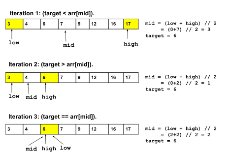
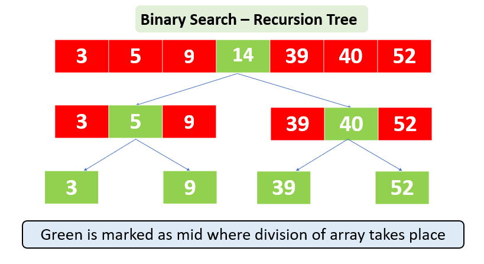
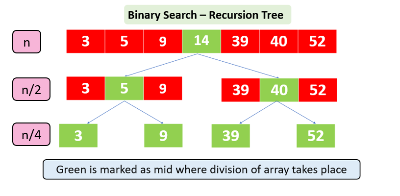
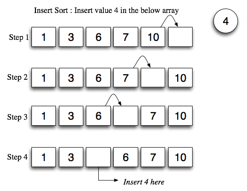

# Linear Search on Unsorted Array


- n = 4 -> 4 ops
- n = 100 -> 100 ops
- n = 1024 -> 1024 ops
- n = 1,048,576 -> 1,048,576 ops
<br>
<span class="blue-text">In worst case, searching time increasing linearly as number of elements increasing</span>

# Binary Search on Sorted Array (Conceptual)
<div class="grid">
    
    
</div>

# Binary Search on Sorted Array (Calculate Depth)
<div class="grid">
    
    
</div>

# Binary Search on Sorted Array (Algorithm)
- Step 1: Divide the search space (array **arr**) into 2 halves, set mid pointer
**mid = (low+high) // 2**
- Step 2: Compare the arr(mid) with the target:
  - If arr[mid] == target: done, return the index.
  - If target > arr[mid]: the next search space will be the right half.
  - If target < arr[mid]: the next search space will be the left half.
- Step 3: Trim down the search space:
  - If the target occurs on the left, we should set the high pointer to mid-1.
  - If the target occurs on the right, we should set the low pointer to mid+1.
- The above steps will continue until either we found the target or the search space becomes invalid i.e. high < low.

# Binary Search on Sorted Array (Time Consuming)
- n = 7 -> 3 ops (removed elements from 7 -> 4 -> 2 -> 1)
- n = 16 -> 4 ops (removed elements from 16 -> 8 -> 4 -> 2 -> 1)
- n = 100 -> 7 ops (removed elements from 100 -> 50 -> 25 -> 13 -> 7 -> 4 -> 2 -> 1)
- n = 1024 -> 10 ops
- In above algorithm, in every step, we are basically dividing the search space into 2 equal halves, dividing the size of the array by 2. After a certain number of divisions, the size will reduce to an situation that we can not divide and the process will stop. The number of total divisions will be equal to the time consuming (time complexity).
```python
# If a number n can be divided by 2 for x times --> 2**x = n
# Therefore, x = log n (base is 2)
```

# Design Sorted Arrays Class


# Implement Sorted Arrays Class
```python
class SortedArray:

    def __init__(self, max_size, typecode="l"): pass
    def __len__(self): pass
    def __getitem__(self, index): pass
    def __repr__(self): pass
    def max_size(self): pass
    def insert(self, value): pass
    def delete(self, target): pass
    def linear_search(self, target): pass
    def binary_search(self, target): pass
    def traverse(self, callback): pass
```

# Insert and Delete an Element on Sorted Array


# Search an Element on Sorted Array


# Implementation a Sorted Array
[Code: sorted array](../Lecture-Data-Structure/code/ch03_sorted_array.py)

# Insert a Value Into Sorted Array (Pseudo Code)

- Pick the last element in the array i.e the element before the empty slot.
- Compare the above array element with the new element we want to insert.
- If the array element is larger than the new element - We  move the array element to a higher memory address or array index.
- We repeat the above process till we hit a condition where the new element is larger than array element.

# Insert a Value Into Sorted Array (Algorithm)

<span class="small-text">Step 1 :  Free slot is at the end of the array, we pick the last but one element in the array which is 10, since 10 is larger than 4, we move 10 to next higher index, now free slot is one level below the last element.
Step 2 :  Now we pick the next element which is 7, since 7 is larger than 4, we move 7 to next higher index, now free slot is two levels below the last element.
Step 3 :  Now we pick the next element which is 6, since 6 is larger than 4, we move 6 to next higher index, now free slot is three levels below the last element.
Step 4 :  Now we pick the next element which is 3, since 3 is less than 4, we insert 4 in the current index.</span>

# Insertion Sort (Animation)


# Insertion Sort (Flow)


# Insertion Sort (Flow)
Step 1 − If it is the first element, it is already sorted. return 1;
Step 2 − Pick next element
Step 3 − Compare with all elements in the sorted sub-list
Step 4 − Shift all the elements in the sorted sub-list that is greater than the value to be sorted
Step 5 − Insert the value
Step 6 − Repeat until list is sorted

# Insertion Sort (Pseudo Code)
```python
Algorithm: Insertion-Sort(A), zero-based
for i = 1 to A.length - 1
   key = A[i]
   j = i – 1
   while j > 0 and A[j] > key
      A[j + 1] = A[j]
      j = j -1
   A[j + 1] = key
```
# Lab
Implement the traverse method for sorted arrays. Then use it to print all the elements in the array in an ascending sequence.