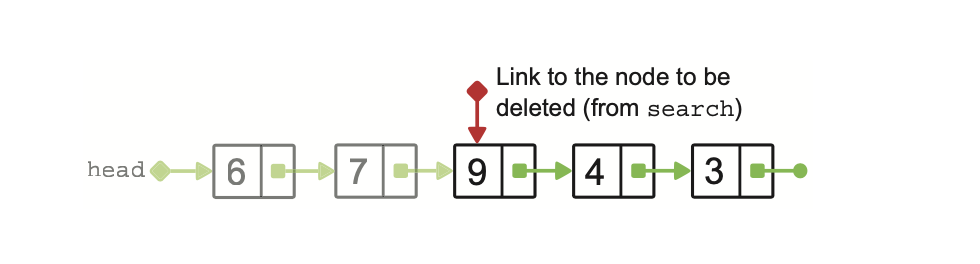
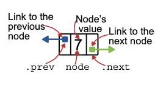

# Chapter 6: Linked List

- What is linked list any why it can do better than array
- Types of linked list
  - Singly linked list
  - Sorted linked list
  - Doubly linked list

# What is a Linked List

A **linked list** is made of nodes

- Each node contains a single value
- Each node also contains a link to the next node
  - The nodes are not in contiguous areas of memory
  - Need an extra piece of data to store the memory location of the next node

<div class="columns">
    
    
</div>

# Linked List vs Array

- Elements of array are stored in contiguous memory
- Nodes of linked list are not stored contiguously. The location of each linked node must be saved.
- A node in a linked node is a small data structure that stores a single value and a link to the next node.
  

# Compare Linked List to Array

- More flexibility: not need allocate space in advance and no data copying cost when add elements
- Lack direct indexing
  - find an element in array: O(1)
  - find an element in linked list: O(n)
    

# Singly Linked List (SLL)

<div class="columns">
    
</div>

- Head node
  - First element of a linked list, no other node points to it
  - Use a variable point to the head node
- Tail node
  - Last element of the list, not point to next node, point to Null
- Each node only knows its successor

# Requirements of Singly Linked List

<div class="columns">
    
    
</div>

# Implement Node Class

```python
class Node:
    def __init__(self, data, next_node = None):
        self._data = data
        self._next = next_node

    def data(self): # Return the data of the current node
        return self.????? #_data

    def next(self): # Return the successor of the current node
        return self.????? #_next

    def has_next(self): # Check if the node has a successor
        return self._next ?? ??? None # is not

    def append(self, next_node): # Append next_node to the current node or None to indicate no successor.
        self._next = ????????? # next_node

    def __str__(self):
        return str(self.data())

    def __repr__(self):
        return f"Node(value: {repr(self._data)}, {id(self)}, next: {id(self._next) if self._next else None})"  
node1 = Node(1); node2 = Node(2, node1)
print(repr(node1)); print(repr(node2))
node3 = Node(3); node4 = Node(4); node3.append(node4)
print(repr(node3)); print(repr(node4))
```

# Design Singly Linked List

- Do not need specify a initial size
- Do not need same data type
- Insert
  - Insert at the end of the list
  - Insert in front
- Search
- Delete
  - Delete by value
  - Delete from the front

# Design Singly Linked List - Insert

<div class="columns">
    
    time = O(n)
    
    time = O(1)
</div>

# Implement Singly Linked List - Insert

```python
import sys
sys.path.append(
    "/Users/jacky/Library/Mobile Documents/com~apple~CloudDocs/交大教學/DSA/Lecture-Data-Structure/my_package")

from linked_lists.singly_linked_node import ???? #Node

class SinglyLinkedList:
    def __init__(self):
        # _head: The head node of the list. Initialized to None.
        self._head = None

    def insert_to_back(self, data): # Append a node to the end of the list.
        current = self._head
        if current is None: # empty single linked list
            self._head = ????(????) #Node(data)
        else:
            while current.????() is not None: #next
                current = current.next()
            current.append(????(????)) #Node(data)

    def insert_in_front(self, data): # Add a node in front.
        old_head = self.????? #_head
        self._head = Node(data, ????????) # old_head
```

# Implement Singly Linked List - Helper Functio

    def traverse(self, functor):

    # Traverse the linked list to put data into a list after applying functor to each node's data.
        current = self._head
        result = []
        while current is not None:
            result.append(functor(current.data()))
            current = current.next()
        return result
    def__len__(self):  # Return the length of the linked list.
        return ???(self.traverse(lambda x: x)) # len
    def __repr__(self):
        return f'SinglyLinkedList({"->".join(self.traverse(repr))})'
    def __str__(self):
        return "->".join(self.traverse(str))
    def size(self):  # Return the length of the linked list.
        size = 0
        current = self.????? # _head
        while current is not None:
            size += 1
            current = current.????() #next
        return ???? # size
    def is_empty(self):
        return self._head is ???? # None

# Design Singly Linked List - Search

<div class="columns">
    
</div>
Time complexity O(n)

# Implement Singly Linked List - Search

```python
    def search(self, target):
        current = self._head
        while current is not None:
            if current.data() ?? target: # ==
                return ??????? # current
            current = current.????() # next
        return ???? # None
```

# Design Singly Linked List - Delete

<div class="columns">
    
    
</div>

- when we want to delete 7, how to do?
  - 讓node(6)的.next指向node(7)的.next
    6.next = 7.next
- when we want to delete 9, we can not just search 9, why?
  - 需要知道 node(9)的前一個節點才能刪除他
- if we need delete the middle node, how to do
  * 先從 head 開始走
  * 每次記住 `current` 和 `previous`
  * 找到 `current.data == target` 的那個節點
  * 然後 `previous.next = current.next`
- if we need delete the first node, how to do?
  - self._head = self._head.next
- if we need delete the last node, how to do
  * 從 head 開始遍歷，直到 `current.next.next == None`
  * 此時 `current.next` 就是最後一個節點
  * 把 `current.next = None`
- What is the time complexity Big-O?
  - O(n)

# Implement Singly Linked List - Delete

```python
    def delete(self, target):
    # Delete the first node with the given data from the list.
        current = self.????? # _head
        previous = ????  # None
        while current is not None:
            if current.data() == target:
                if previous is None:  # delete the head of the list
                    self._head = current.next()
                else: # previous, current.next
                    ????????.append(???????.????()) # a node in the middle or at the end
                return
            previous = current
            current = current.next()
        raise ValueError(f"No element with value {target} was found.")
        # If get here, empty list or value not found
```

Test case need test empty list, delete first node, delete last node, delete middle node

# Sorted Linked List

<div class="columns">
    
</div>

Traverse the list to find the right place to insert the new value

- Find the node after which the new value should be added
- Update the links in the list to include the node that stores the new value

# Implement Sorted Linked List

```python
def insert(self, new_data):
        # Insert a new value into the sorted singly linked list.
        current = self._head
        previous = None
        while current is not None:
            if current.data() ?? new_data: # >=
                if previous is None: #current is head
                    self._head = Node(new_data, ???????) # current   # Add the element at the beginning of the list
                else: # General case, previous has node
                    ????????.append(Node(new_data, ???????))    # previous , current
                return
            previous = ??????? # current
            current = current.????() # next
        if previous is None:
            self._head = Node(new_data)    # The list is ?????（empty）
        else:
            previous.append(Node(new_data, None))    # Add the element at the ???（end) of the list 
```

# Doubly Linked List (DLL)

<div class="columns">
    
    
</div>

- If we have a link to a single node of the list, we can reach any other node in the
  list, both before and after it.
- Weak points
  - Each node of a DLL takes up more space than SLL.
  - Each node insertion or deletion action, we need update two links.

# Doubly Linked Node

<div class="columns">
</div>
    

# Implement Doubly Linked Node

```python
class DoublyLinkedNode:
    def __init__(self, data):
        self._data = data
        self._next = None
        self._prev = None

    def __str__(self):
        return str(self.data())

    def __repr__(self):
        return f"DoublyLinkedNode(value:{self._data}, address:{id(self)}, previous:{id(self._prev) if self._prev else None}, next:{id(self._next) if self._next else None})"

    def data(self):
        return self._data

    def next(self):  # return the successor of the current node.
        return self._next

    def has_next(self):
        return self._next is not None

    def append(self, next_node):  # append a node to the current one
        self._next = ????????? #next_node
        if next_node is not None:
            next_node.????? = self #_prev

    def prev(self):  # return the predecessor of the current node.
        return self._prev

    def has_prev(self):  # check if the node has a predecessor
        return self._prev is not None

    def prepend(self, prev_node):  # prepend a node to the current one.
        self.????? = prev_node #_prev
        if prev_node is not None:
            prev_node._next = ???? #self
```

# Design Doubly Linked List - Insert

<div class="columns">
    
    
    
</div>

# Implement Doubly Linked List - Insert

```python
import sys
sys.path.append("/Users/jacky/Library/Mobile Documents/com~apple~CloudDocs/交大教學/DSA/Lecture-Data-Structure/my_package")
from linked_list.doubly_linked_node import DoublyLinkedNode

class DoublyLinkedList:
    def __init__(self):
        self._head = None
        self._tail = None
  
    def insert_in_front(self, data):
        if self._head is None: # empty list
            self._tail = self._head = DoublyLinkedNode(data)
        else:
            old_head = self.????? #_head
            self._head = DoublyLinkedNode(data)
            self._head.append(????????) #old_head

    def insert_to_back(self, data):
        if self._tail is None:
            self._tail = self._head = DoublyLinkedNode(data)
        else:
            old_tail = self.????? #_tail
            self._tail = DoublyLinkedNode(data)
            self._tail.prepend(????????) #old_tail

    def insert_in_middle(self, data, index):
        pass # Homework   
    if index < 0 or index > self.size():
            raise IndexError("Index out of bounds")

        if index == 0:
            self.insert_in_front(data)
            return

        if index == self.size():
            self.insert_to_back(data)
            return

        # Step 1: 找到 index 的節點
        current = self._head
        for _ in range(index):
            current = current.next()

        # Step 2: 建新節點、插入在 current 前
        new_node = DoublyLinkedNode(data)
        prev_node = current.prev()

        new_node.append(current)     # new_node.next = current
        new_node.prepend(prev_node)  # new_node.prev = prev_node

        if prev_node:
            prev_node.append(new_node)
        if current:
            current.prepend(new_node)
```

# Implement Doubly Linked List - Delete

```python
    def delete(self, target):
        node = self.search(target)
        if node is None:
            raise ValueError(f"No element with value {target} was found")
        if node.prev() is None:  # Delete node from front
            self._head = node.next()
            if self._head is None:  # only one element in the list
                self.????? = None #_tail
            else:
                self._head.prepend(????) #None
        elif node.next() is None:  # Delete node from back
            self._tail = node.????() #prev
            self._tail.append(None)
        else:
            node.prev().append(node.next())
  
    def delete_from_front(self):
        if self.is_empty():
            raise ValueError("Delete on an empty list.")
        data = self._head.data()
        self._head = self._head.????()#next
        if self._head is ????:#None
            self._tail = None
        else:
            self._head.prepend(????)#None
        return data
  
    def delete_from_back(self):
        if self.is_empty():
            raise ValueError("Delete on an empty list.")
        data = self._tail.data()
        self._tail = self._tail.????()#prev
        if self._tail is None:
            self._head = None
        else:
            self._tail.??????(None)#append
        return data
```

# Homework

DSA HW (F)
