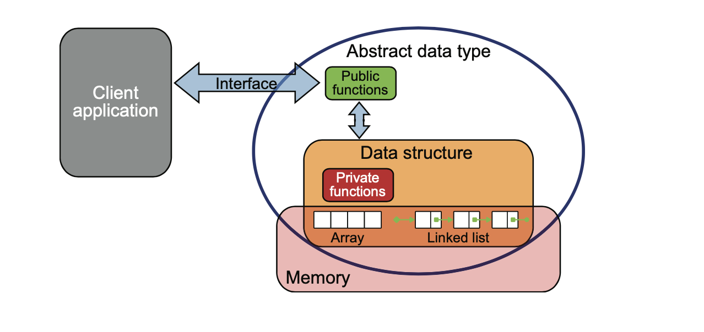
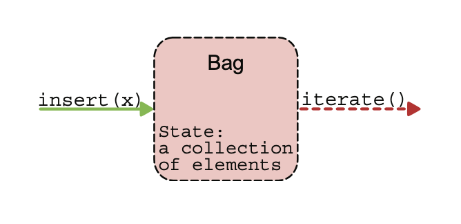

# Chapter 7: Abstract Data Types

- **Abstract data type (ADT)** is a mathematical model for data types, defined by its behavior from the point of view of data users specifically in terms of
  - possible values
  - possible operations
  - behavior of operations
- Data structures we learned before, which are concrete representations of data, and are the point of view of an implementer, not a user.
- ADT example: a STACK has push/pop operations that follow a Last-In-First-Out rule, and can be concretely implemented using either a list or an array.

# Three-Level Hierarchy

- **Abstract data type**: a theoretical concept that describes at a high level how data can be organized and the operations that can be performed on the data.

抽象資料型別（ADT）是邏輯上的設計概念，定義了資料的 **型態** 、**行為**與可進行的 **操作** ，不涉及任何底層儲存細節。

> Stack：支援 push、pop、peek、is_empty
> Queue：支援 enqueue、dequeue

- **Data structure**: how data is organized in memory (or disk!) and the internal representation details of the DS

資料結構指的是「如何在記憶體中實際安排資料」，例如用 **陣列** 、 **節點鏈結（linked list）** 、**樹狀結構**等方式實現。

> Stack 可以用 array 或 linked list 來表示
> Tree 可以用節點加左右子樹

- **Implementation**: choose a programming language and translate the DS into code.

實作層是 **把資料結構用程式語言具體實現出來** ，包括 class、method、變數操作、記憶體管理等。

> 用 Python 的 class 實作一個 Stack
> 用 C 的 struct 與 pointer 實作 Binary Tree



# A Simple ADT: Bag (Shopping Cart)


A bag is a collection of objects with 2 methods:

- insert(x)— allow a client to add a single element to the bag. The order of insertion is not important.
- iterate() — allow a client to go through all the elements in the bag. The order in which elements are iterated is not guaranteed.
- Data structure : Singly Link
- Implementation: Python

# Implementation of Bag

```python
class Bag:
    def __init__(self):
        self._data = SinglyLinkedList()

    def insert(self, value):
        self._data.insert_in_front(value)

    def traverse(self):
        return self._data.traverse()    
```
