# Chapter 8: Stack

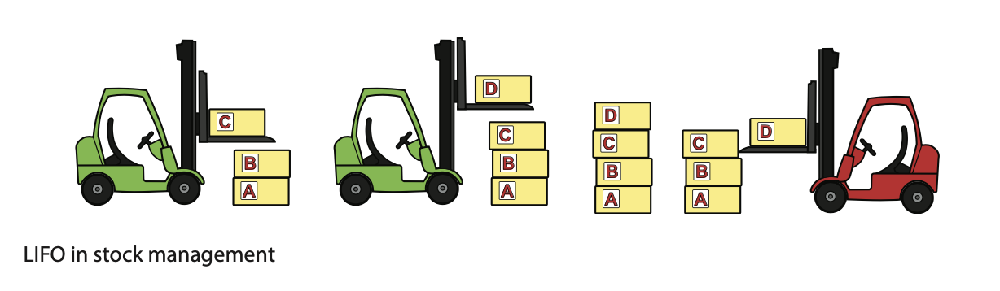

- **Stack** is a container that allows elements to be added or removed according to LIFO rule (last in, first out).

# Requirements of a Stack

Stack follows **LIFO** rule, we design its interface with only two methods:

- Push(): insert an element into the stack
- Pop() or Top(): remove the most recently added element from the stack and return it
- We also need to keep track of the last element that was added to the stack, is called the **top** of the stack.

<div class="columns">
    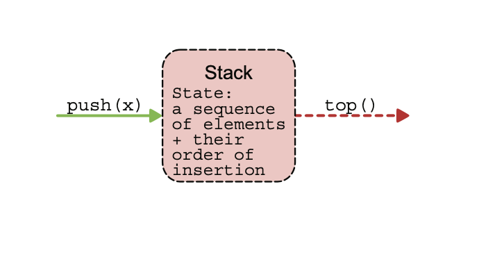
    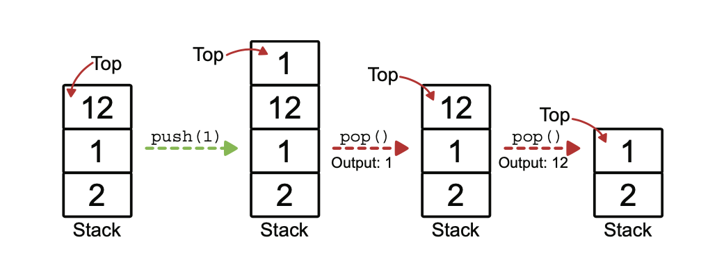
</div>

# Consider Three Data Structures to Implement Stack

- A static array
- A dynamic array
- **A linked list**: use singly linked link(SLL) and insert / delete from the front are both O(1) for SLLs

<div class="middle-grid">
    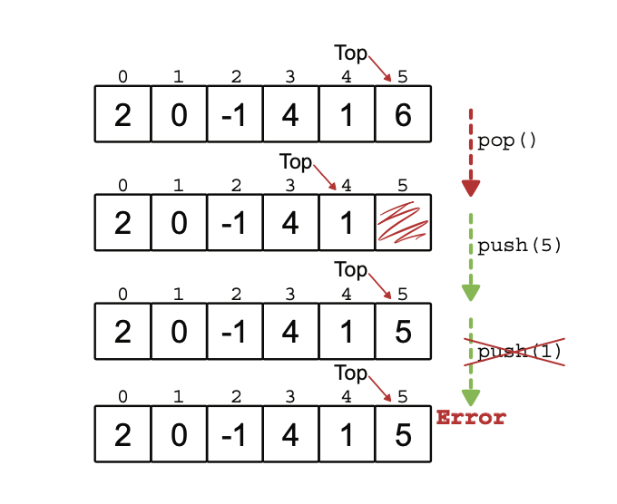
    
    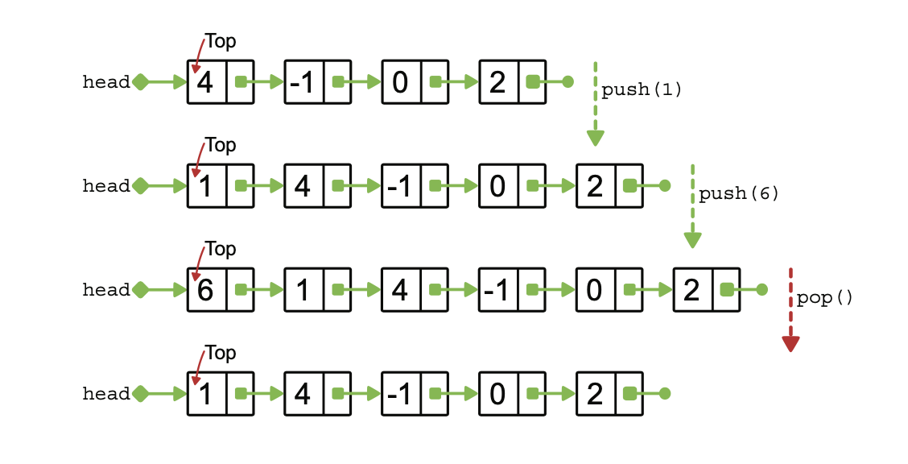
</div>

# Design Stack by Singly Linked List

<div class="columns">
    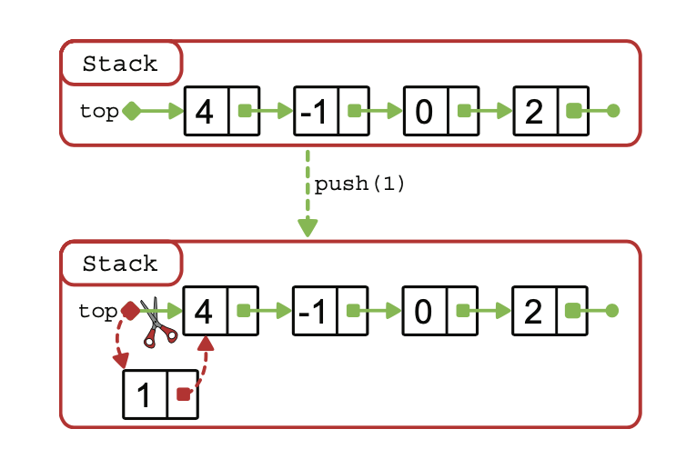
    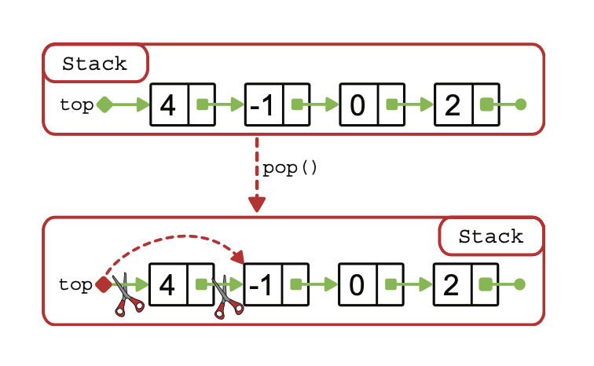
</div>

# Implement Stack - Push

```python
class Stack:
    def __init__(self):
        self._data = SinglyLinkedList()

    def push(self, value):
        self._data.???????????????(value) #insert_in_front(value)
```

# Implement Stack - Pop

```python
def pop(self):
    if self.is_empty():
        raise ValueError("Cannot pop from an empty stack")
    return self._data.?????????????????() #delete_from_front()

def peek(self):  # access the data, not pop it
    if self.is_empty():
        raise ValueError("Cannot peek at an empty stack")
    return self._data.?????.data() #head
```

# Theory vs. the Real World

- Considering Big O
  - Stack by SLL: O(1)
  - Stack by Dynamic array: O(n), but if a large number of operations is performed, their amortized (攤銷的) cost can be considered O(1).
- Considering implementation
  - You shouldn’t implement your own library unless it’s absolutely necessary
  - If the library is critical for your application and can become a bottleneck, you should profile it.
  - You shouldn’t profile all your code though. Focus on the critical sections where optimization will improve efficiency the most.

# Profiling Example

- Class Stack in stack.py coded by SLL
- Class StackArray in stack_dynamic_array.py coded by List to simulate dynamic array

<div class="columns">
    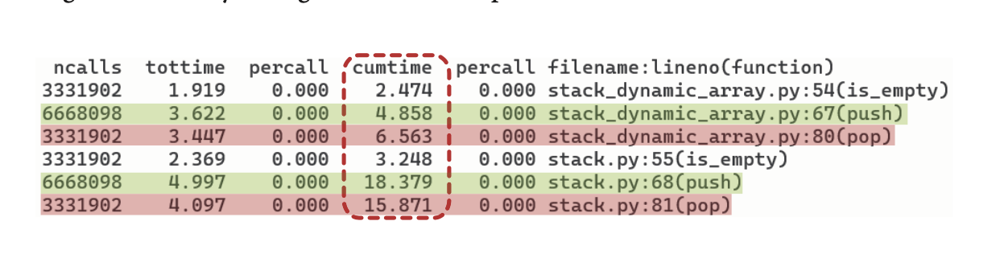
    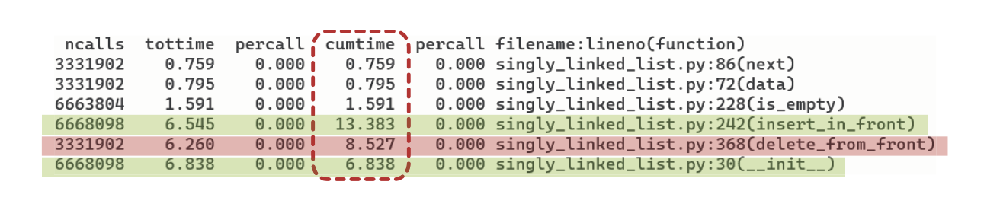
</div>

- Python provides an optimized, extremely efficient implementation for list. This
  code is usually written in C and compiled for use in Python
- With linked lists, we must allocate a new node on each call to push and then
  destroy a Node object on each pop. Allocating the memory and creating the
  objects takes time.

# Stack Application - Evaluating Expression

- Infix notation: 3 + 2
- Postfix notation: 3 2 +
- In infix notation, 3 + 2 * 4 == 3 + (2 * 4) based on operator precedence, if we want to add 3 and 2 first, the formula will be (3 + 2) * 4
- In postfix notation, we use 3 2 4 * + and 3 2 + 4 * respectively
- 

<div class="columns">
    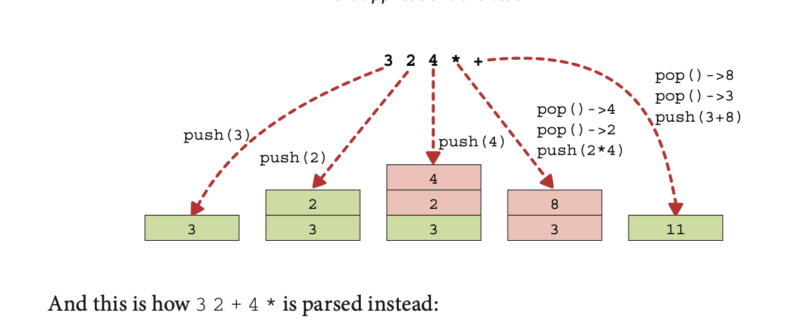
    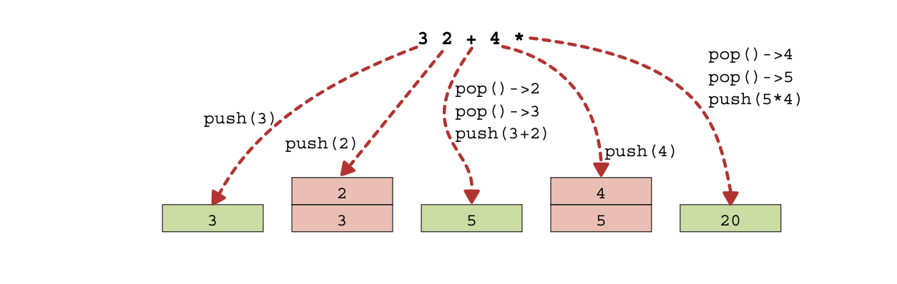
</div>

# Recap

- A stack is a container that abides by the LIFO policy.
- Stacks provide two operations: push and pop. No other way to insert or delete elements, and search is generally not allowed.
- A stack can be implemented using either arrays or linked lists to store its elements.
  - Using dynamic arrays, push and pop take O(n) time in the worst case, but O(1) amortized time (over a large number of operations).
  - Using SLLs, push and pop take O(1) time in the worst case.
- The amortized performance of the two implementations is close, and profiling can help you understand which of the two implementations is more efficient in a
  given programming language.

# Homework

DSA HW (G)
