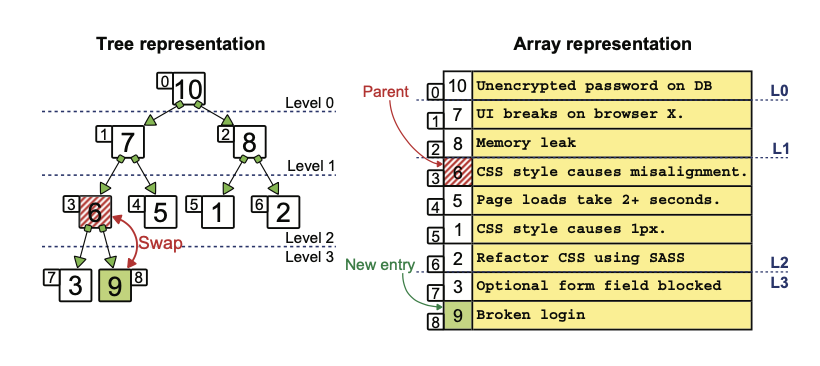

# Chapter 10: Priority Queues and Heaps


- **Priority Queue** is a container that allows elements to be added or removed according to its priority.
- When a new element enters the priority queue, it’s not placed last. Its position is determined by its priority.
- An emergency room of a hospital or bug fixing list

# Requirements of a Priority Queue

Priority queue always return the element with the highest priority. Two methods in its interface:

- insert(x, p): insert an element x having priority p into the priority queue
- top() or extract_max(): remove the highest-priority item from the priority queue and return it

<div class="columns">
    
</div>

# Sorted Data Structures to Implement Priority Queue

- Sorted array
- Sorted linked list
- Insertion is O(n): go through the whole list
- Extracting the highest priority element is O(1): at the front of a linked list or at the end of an array.

<div class="middle-grid">
    
    
</div>

# Unsorted Data Structures to Implement Priority Queue

- Unsorted array
- Unsorted linked list
- Insertion is O(1): at the front of a linked list or at the end of an array
- Extracting the highest priority element is O(n): go through the whole list.

<div class="middle-grid">
    
    
</div>
Can we have a balance between insert() and top()?

# Performance overview


# Heap

A heap is a special kind of tree. It can be **binary heaps** or **d-way heaps** (heaps where nodes have more than two children)

<div class="middle-grid">
    
    
</div>

# Heap Properties

1. A binary heap, each node of the tree can have at most two children
2. Heap tree is “almost complete”
   - Every level of the tree is complete, except the last level
   - Nodes on the last level are as far left as possible (盡可能靠左)
3. each node holds the highest priority element in the subtree rooted at that node

<div class="middle-grid">
    
    
</div>

# Heap Features

- Partial sort: all paths from the root to any leaf of the tree are sorted.
- Node number of each level: there are 2_i nodes of level i. (i is the height, distance from the root).

<div class="middle-grid">
    
    
</div>

# Performance of Heap

Implementing insert and top operations only walk a path from the root to a leaf. This means that their running time is proportional to the height of the heap (log n).

<div class="middle-grid">
    
</div>

# Max-heap and Min-heap

- A max-heap is a heap where each parent has a value no smaller than its children. priority(P) ≥ priority(C)
- Set a priority function to turn min-heap to max-heap because max-heap is more straight-forward, like f(x) = -x

<div class="middle-grid">
    
</div>

# Design a Heap

- We could implement a heap as a tree. But, we do not. We have a better way.
- The node with index 3. Its parent has index 1, and its children have indexes 7 and 8.
- Given a node with an index i > 0, its parent’s index is given by the integer division (i - 1) // 2, and its children have indexes 2 * i + 1 and 2 * i + 2
- Assuming the static array has enough space to store the elements and left-justified.

<div class="middle-grid">
    
    
</div>

# Implement Heap Init and Helper Functions

```python
# uses an array (a Python list) as an internal attribute
class Heap:
    def __init__(self, elements=None element_priority=lambda x: x):
        self._priority = element_priority
        if elements is not None and len(elements) > 0:
            self._heapify(elements)
        else:
            self._elements = []

    def _has_lower_priority(self, element_1, element_2):
        return self._priority(element_1) < self.?????????(element_2)#_priority
  
    def _has_higher_priority(self, element_1, element_2):
        return self._priority(element_1) ? self._priority(element_2) #>
  
    def _left_child_index(self, index):
        return index * ? + ? #2#1 ##注意index start from 0
  
    def _parent_index(self, index):
        return (index ? ?) ?? 2  #-1#//  
```
# Design Heap Insert (Bubble Up)

<div class="middle-grid">
    
    
</div>
<br>
<div class="middle-grid">
    
    
</div>

# Implement Heap Insert

```python
def insert(self, element):
    self._elements.??????(element) #append
    self._bubble_up(len(self._elements) - 1)

def _bubble_up(self, index):
    element = self._elements[index]
    while index > 0:
        parent_index = self.?????????????(index) #_parent_index
        parent = self._elements[parent_index]
        if self._has_higher_priority(???????, parent): #element
        # There is a violation of the heap’s property, nad we need to swap the new element with its parent
            self._elements[index] = ????? #parent
            index = ???????????? #parent_index
        else:
        # The new element and its parent don’t violate the heap’s properties, so we have found the final place to insert the new element.  
            ????? #break
    self._elements[index] = ???????   #element
```

# Design Heap Top (Push Down)

<div class="middle-grid">
    
    
    
</div>

# Implement Heap Top

```python
#def top(self):
    if self.is_empty():
        raise ValueError('Method top called on an empty heap.')
  
    if len(self) == 1:
        # If the heap has a single element, we just need to pop its root.
        element = self._elements.pop()
    else:
        element = self._elements[0]
        self._elements[?] = self._elements.???() #0 #pop
        self._push_down(?) #0
    return element
```

# Implement Heap Top Helper (_push_down)

```python
    def _push_down(self, index):
        if not (0 <= index < len(self._elements)):
            raise IndexError("Out of range of the heap")
        element = self._elements[index]
        current_index = index
        while True:
            child_index = self._highest_priority_child_index(current_index)
            if child_index is None:
                break
            if self._has_lower_priority(???????, self._elements[child_index]): #element
                self._elements[current_index] = self._elements[child_index]
                current_index = child_index
            else:
                break

        self._elements[current_index] = ??????? #element
```

# Implement Heap Top Helper (_highest_priority_child_index)

```python
def _highest_priority_child_index(self, index):
    first_index = self._left_child_index(index)
    if first_index >= len(self):
        # The current node has no children.
    return None
  
    if first_index + 1 >= len(self):
    # The current node only has one child.
    return first_index

    if self._has_higher_priority(self._elements[first_index], self._elements[first_index + 1]):
        return first_index
    else:
        return first_index ? 1
```

# Design Heap Heapify

<div class="middle-grid">
    
    
    
</div>

# Implement Heap Heapipy

Takes O(n) comparison and assignments

```python
def _heapify(self, elements):
    self._elements = elements[:]
    last_inner_node_index = self._first_leaf_index() - 1
    for index in range(last_inner_node_index, ??, ??):
        self._push_down(index)

def _first_leaf_index(self):
    return len(self) // ?
```
Assume i is the index of last internal node ⮕ 2i + 1 < n ⮕ 2i + 1 <= n - 1 ⮕ 2i <= n -2 ⮕ i <= n/2 -1
The 1st leaf node is i + 1 ⮕ n/2 ⮕ considering one-child and two-child cases, we use n//2 

# Design 'Find the k Largest Entries'


Maintain a min-heap of the top k elements seen so far.
Iterate through all elements:

- If the heap has fewer than k elements → push it in.
- Else if the element is larger than the smallest (root) in the heap → pop the smallest and push the new one.

# Implement 'Find the k Largest Entries'

```python
"""Module providing an implementation for stack, using singly-linked lists to store the elements."""
import sys

sys.path.append(
    "/Users/jacky/Library/Mobile Documents/com~apple~CloudDocs/交大教學/DSA/Lecture-Data-Structure/my_package")
from heaps.heap import Heap

def k_largest_elements(arr, k):
    heap = Heap(element_priority=lambda x: -x)
    for i in range(len(arr)):
        if len(heap) >= k:
            if heap.peek() < arr[i]:
                heap.top()
                heap.insert(arr[i])
                print(heap)
        else:
            heap.insert(arr[i])
            print('inserted', arr[i])
            print(heap)
    print(heap)        
    return heap.top()
# main
nums = [6, 5, 2, 1, 8, 7]
k = 3
print(k_largest_elements(nums, k))
```

# Recap

- A priority queue is an abstract data type that provides two operations: insert and top.
- Priority queues can be implemented using different data structures, but heap is the most efficient way.
- A binary heap is a special type of tree. It’s a binary, almost complete tree, where each node has a priority higher than or equal to its children’s.
- Heaps have another characteristic. They are a tree that is better implemented as an array. This is possible because a heap is an almost complete tree.
- With the array implementation of a heap, we can build a priority queue where insert and top take O(log n) time.
